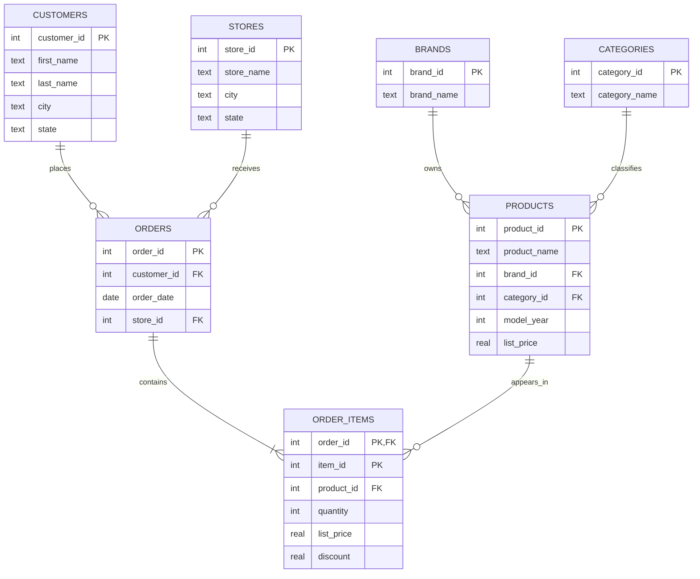

# Bike Retail Sales Analytics with SQL & Python

A recruiter-facing analytics project built from a seven-table bicycle retail dataset. The project demonstrates **relational database design, SQLite, SQL joins and aggregation, Python analytics, business KPI design, data validation, and reproducible reporting**.

## Business questions

1. Which stores generate the most revenue and orders?
2. Which products, brands, and categories drive sales?
3. How did revenue change over time?
4. Which stores have the highest average order value?
5. How much repeat purchasing is visible in the customer base?

## Headline results

| KPI | Result |
|---|---:|
| Total net revenue | **$7.69M** |
| Orders | **1,615** |
| Units sold | **7,078** |
| Unique customers | **1,445** |
| Average order value | **$4,761** |
| Weighted average discount | **10.37%** |
| Repeat-customer rate | **9.07%** |

### Store performance

| Store | Revenue | Orders | AOV | Revenue share |
|---|---:|---:|---:|---:|
| Baldwin Bikes | $5.22M | 1,093 | $4,772 | 67.8% |
| Santa Cruz Bikes | $1.61M | 348 | $4,614 | 20.9% |
| Rowlett Bikes | $0.87M | 174 | **$4,986** | 11.3% |

**Interpretation:** Baldwin Bikes dominates total revenue because it handles far more orders, while Rowlett Bikes has the highest average order value.

### Product and category highlights

- **Trek Slash 8 27.5 - 2016** generated the highest product revenue at approximately **$555.6K**.
- **Mountain Bikes** generated the most category revenue at approximately **$2.72M**.
- **Trek** was the strongest brand by revenue at approximately **$4.60M**.
- Revenue rose from **$2.43M in 2016 to $3.45M in 2017**, an increase of about **42.0%**.

## Why this version is different from the original coursework

The original assignment demonstrated the core idea, but this portfolio version rebuilds it as a professional analytics project:

- uses a normalized relational schema with explicit foreign keys;
- uses a composite primary key for `order_items`;
- enables SQLite foreign-key enforcement;
- corrects net revenue to `list_price * (1 - discount) * quantity`;
- separates schema creation, SQL analysis, Python orchestration, tests, and outputs;
- removes academic identifiers and assignment-specific wording;
- excludes customer contact details from published outputs;
- documents assumptions and limitations.

## Data model



## Repository structure

```text
bike-retail-sql-analytics/
├── README.md
├── requirements.txt
├── data/
│   └── README.md
├── docs/
│   ├── CASE_STUDY.md
│   └── DATA_DICTIONARY.md
├── results/
│   ├── key_metrics.csv
│   ├── store_performance.csv
│   ├── top_products.csv
│   └── ...
├── sql/
│   ├── schema.sql
│   └── analysis_queries.sql
├── src/
│   └── retail_analytics.py
└── tests/
    └── test_revenue.py
```

## Run locally

Place the seven source CSVs in `data/raw/`:

`brands.csv`, `categories.csv`, `customers.csv`, `order_items.csv`, `orders.csv`, `products.csv`, `stores.csv`

Then run:

```bash
python -m venv .venv
# Windows: .venv\Scripts\activate
# macOS/Linux: source .venv/bin/activate
pip install -r requirements.txt
python src/retail_analytics.py
```

Run tests with:

```bash
pytest -q
```

## Data publication note

The raw CSVs were supplied as coursework data and are **not redistributed in this public-ready version** because their original licensing/provenance was not established. The repository publishes only non-identifying aggregate outputs and the code required to reproduce them when the source tables are available.

## Skills demonstrated

`SQL` · `SQLite` · `Relational modelling` · `Joins` · `Aggregations` · `Python` · `pandas` · `Data validation` · `Business KPIs` · `Revenue analysis` · `GitHub Actions` · `Testing`
